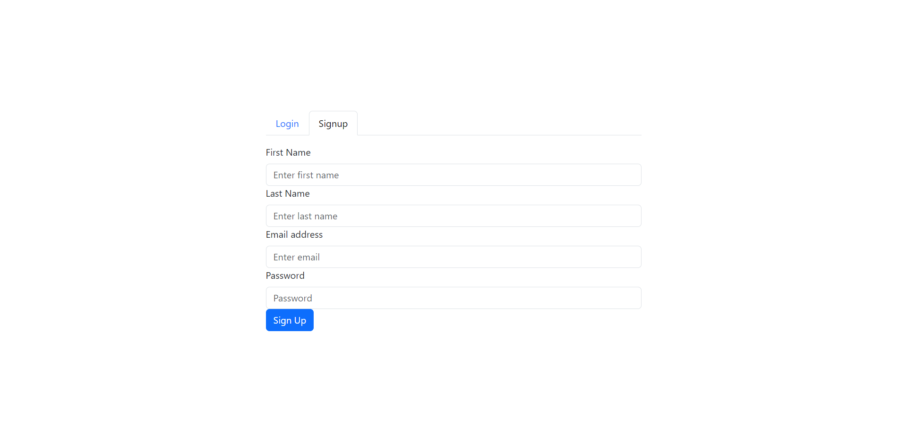
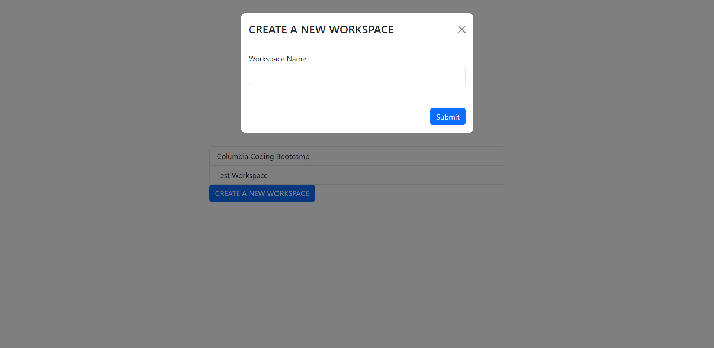
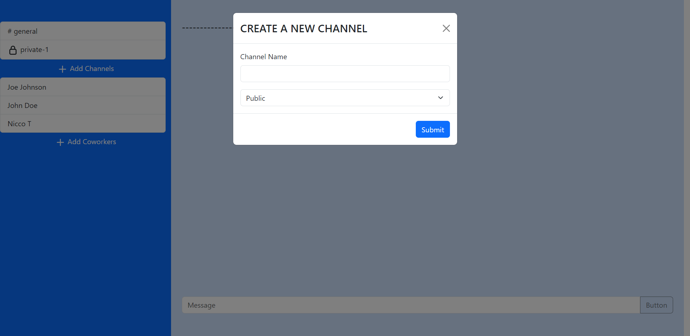
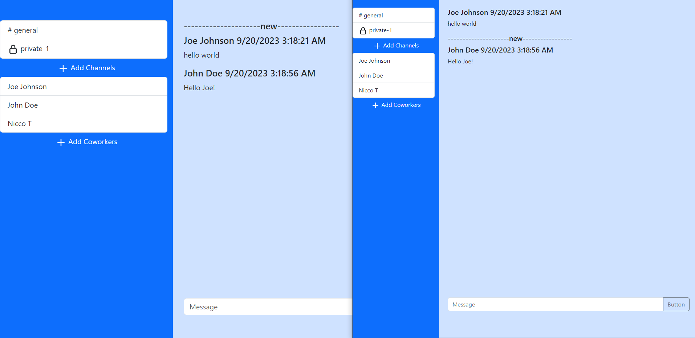

# Realtime Chat App

[](./LICENSE) 

## Description

This is a realtime chat app, designed to replicate the core features of Slack. This project is focused on providing real-time communication feature.

## Table of Contents  
- [Link](#link)
- [Screenshots](#screenshots)
- [Installation](#installation)
- [Usage](#usage)
- [License](#license)
- [Questions](#questions)  

## Motivation for development: 

* Leverage Apollo Subscriptions to deliver live chat experience

* In the contemporary work environment, remote work and real-time communication have become pivotal. 

* Skill Development and Learning: analyzing and tackling complex applications; planning the necessary technological stack, looking for future learning and improvement.

## Tech stack


## Link

https://rocky-brook-12551-f0a28b7b81ba.herokuapp.com/

## Screenshots

Login / sign-up page


Homepage / create workspace


Workspace page / create channel


chat page / receiving realtime message


## Installation  

```bash
npm install
```

## Usage  

```bash
npm run develop
``` 

## License  

This project is licensed under the [MIT license](LICENSE).  

## Questions  

If you have any questions about the repository, open an issue or contact me directly at [m.tan1230@gmail.com](mailto:m.tan1230@gmail.com). You can find more of my work at [Mtan1230](https://github.com/Mtan1230).
